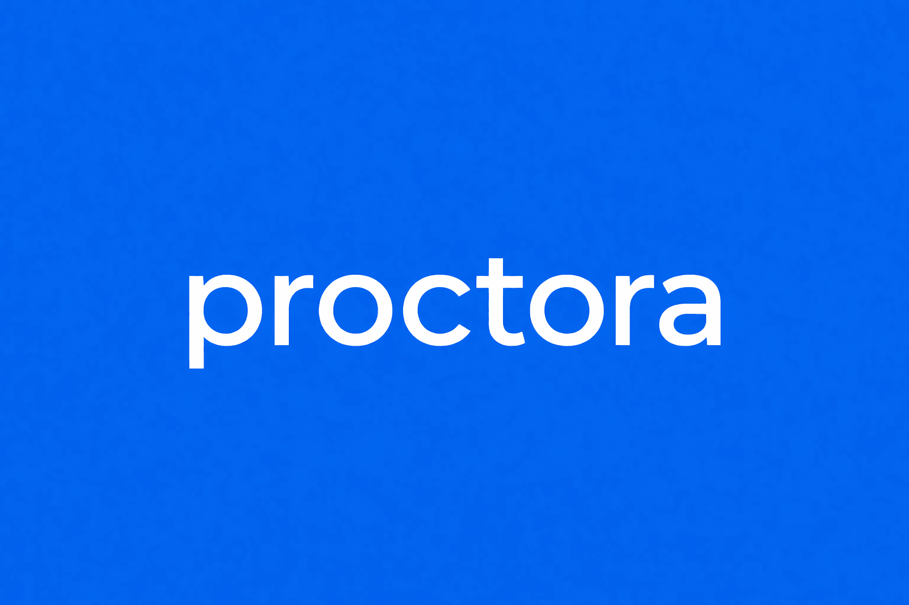
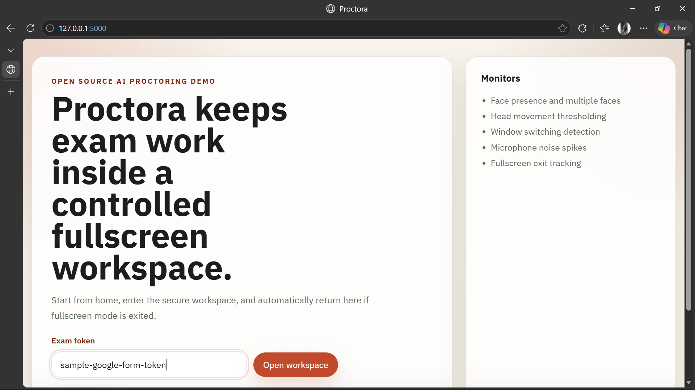
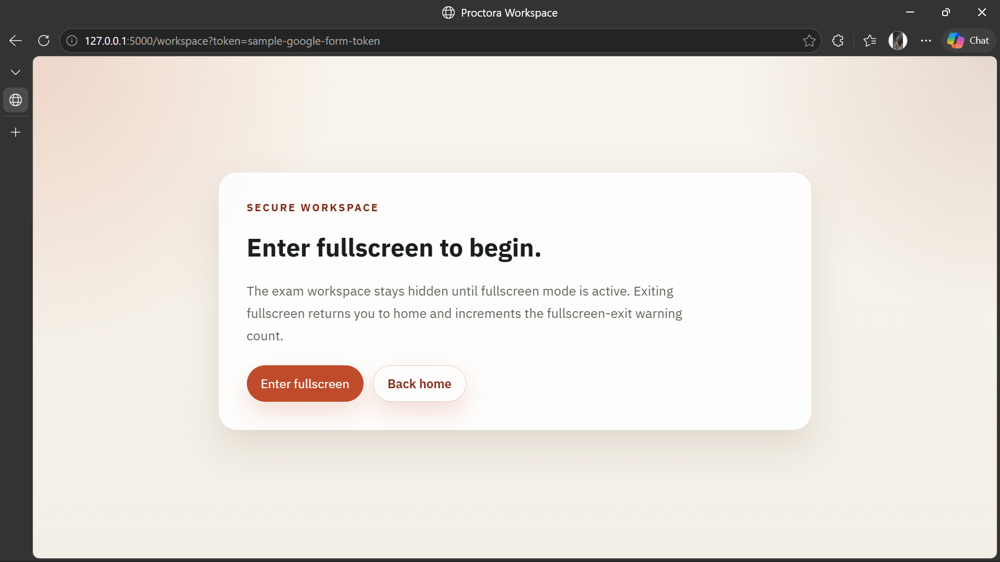
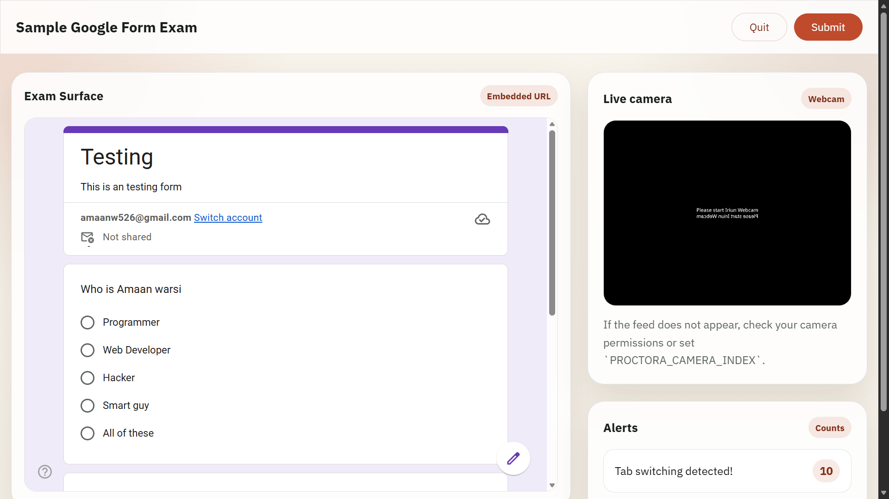
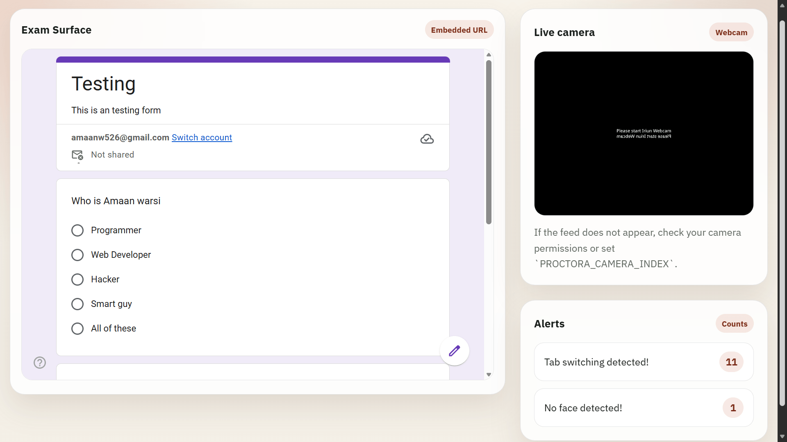
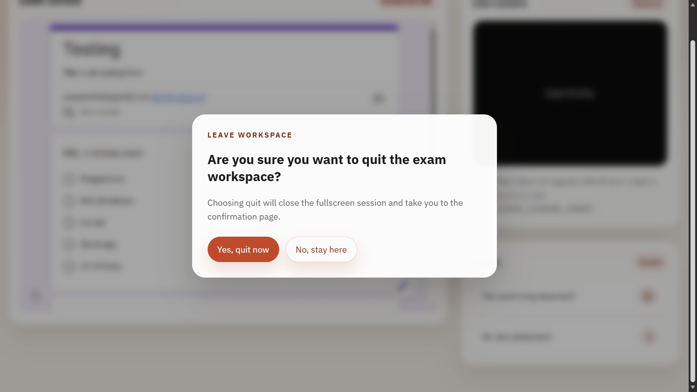
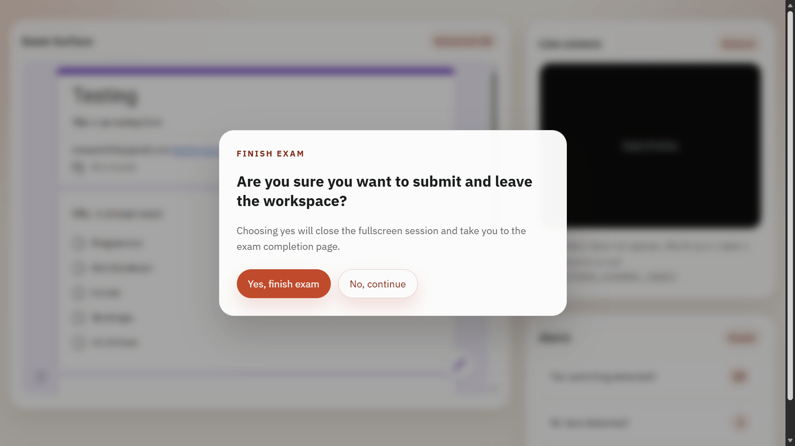
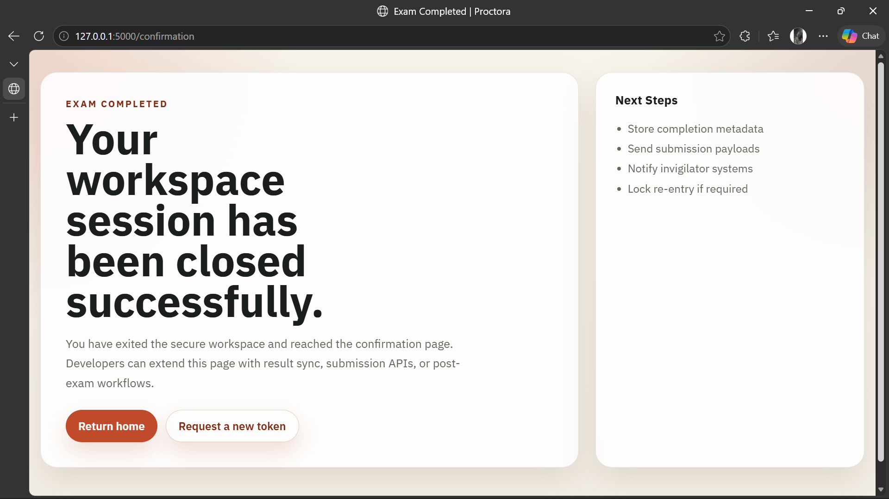

# Proctora

<p align="center">
  
</p>

<p align="center">
  <a href="https://github.com/amaanwarsi/Proctora/actions/workflows/ci.yml">
    
  </a>
  <a href="https://github.com/amaanwarsi/Proctora/blob/main/LICENSE">
    
  </a>
  <a href="https://www.python.org/downloads/">
    
  </a>
  <a href="https://github.com/amaanwarsi/Proctora">
    
  </a>
</p>

Proctora is an open-source online exam proctoring demo built with Flask, OpenCV, MediaPipe, and a small database-backed session layer. It provides a browser-based fullscreen workspace, token-based exam access, live webcam streaming, microphone noise detection, window-switch monitoring, and session/violation persistence for local development and experimentation.

This repository is best understood as a developer-oriented foundation, not a production-ready proctoring platform. It is useful for prototyping flows, testing device checks, exploring exam-session models, and extending monitoring logic, but it does not yet provide the hardened security, identity verification, audit controls, deployment model, or privacy controls required for real-world high-stakes exams.

> **Note:** This is a polished and upgraded version of the original [Internal_hackathon_NEOPYTES_42](https://github.com/amaanwarsi/Internal_hackathon_NEOPYTES_42) repository.


## Screenshots

| Home | Start | Workspace |
|------|-------|-----------|
|  |  |  |

| Detections Alert | Alert Quit | Alert Submit |
|-----------------|------------|---------------|
|  |  |  |

| Confirmation |
|--------------|
|  |


## Highlights

- Token-based exam entry backed by the database instead of environment-only access control
- Fullscreen-gated workspace flow with automatic fallback to the home page when fullscreen is exited
- Live webcam feed via OpenCV
- Face monitoring with MediaPipe for no-face, multiple-face, and head-shift events
- Microphone noise detection using `sounddevice`
- Active-window change detection using `PyGetWindow`
- In-memory live alert aggregation exposed through `/alerts`
- Database-backed models for exams, tokens, candidates, sessions, violations, results, and event logs
- Session locking to prevent duplicate active sessions on the same device for the same exam
- Device reuse blocking after a session is completed
- SQLite runtime schema for local development and a MySQL 8 migration script in `DB.sql`
- Basic automated test coverage and GitHub Actions CI

## Current Flow

1. A developer seeds an exam and an `exam_token` into the database.
2. A candidate opens `/`, enters the token, and is sent to `/workspace?token=...`.
3. The backend resolves the exam from `exam_tokens.token`.
4. The workspace remains hidden until fullscreen mode is granted by the browser.
5. While the workspace is active, the app can surface alerts for supported monitoring events.
6. If fullscreen is exited unexpectedly, the user is redirected back to `/` and a browser-stored warning count is incremented.
7. When the candidate finishes or quits, the UI redirects to `/confirmation`.

## Tech Stack

- Python 3.10+
- Flask
- OpenCV
- MediaPipe
- NumPy
- `sounddevice`
- `PyGetWindow`
- SQLite for local runtime storage
- MySQL 8 migration reference in `DB.sql`

## Device and Environment Requirements

Proctora is a desktop-oriented app today. For the best results, use a local machine with:

- Python 3.10 or newer
- A webcam accessible to OpenCV
- A microphone accessible to `sounddevice`
- A modern desktop browser with fullscreen support
- Camera and microphone permissions enabled in the browser and OS
- A desktop windowing environment if you want active-window tracking

Recommended environment:

- Windows 10/11 or another desktop OS with working webcam and audio drivers
- Python 3.11 is a good baseline and is already covered by CI

Important compatibility notes:

- Webcam access can fail if another app is already using the camera or if the configured camera index is wrong.
- `sounddevice` depends on system audio support and can fail when no input device is available.
- `PyGetWindow` behavior varies across operating systems and window managers.
- Fullscreen requests must be initiated by user interaction in many browsers.
- VM or environment detection is heuristic and OS-dependent.
- Headless servers, containers, and remote CI runners are not realistic environments for the full monitoring stack.

## Project Structure

```text
proctora/
|- app.py
|- pyproject.toml
|- requirements.txt
|- DB.sql
|- LICENSE
|- CONTRIBUTING.md
|- README.md
|- .github/
|  \- workflows/
|     \- ci.yml
|- src/
|  \- proctora/
|     |- __init__.py
|     |- __main__.py
|     |- app.py
|     |- config.py
|     |- routes.py
|     |- database/
|     |  |- __init__.py
|     |  |- repository.py
|     |  \- schema.py
|     |- services/
|     |  |- __init__.py
|     |  |- alerts.py
|     |  \- proctoring.py
|     |- static/
|     |  |- app.min.js
|     |  |- style.min.css
|     |  \- src/
|     |     |- app.js
|     |     \- style.css
|     \- templates/
|        |- index.html
|        |- workspace.html
|        \- confirmation.html
\- tests/
   \- test_app.py
```

## Installation

### 1. Clone the repository

```bash
git clone https://github.com/amaanwarsi/Proctora.git
cd proctora
```

### 2. Create and activate a virtual environment

Windows:

```powershell
python -m venv .venv
.venv\Scripts\Activate.ps1
```

macOS/Linux:

```bash
python -m venv .venv
source .venv/bin/activate
```

### 3. Install the project

```bash
pip install -e .[dev]
```

## Configuration

The app loads configuration from environment variables and `.env` at startup.

Supported settings in the current codebase:

- `PROCTORA_APP_NAME`
- `PROCTORA_DEBUG`
- `PROCTORA_HOST`
- `PROCTORA_PORT`
- `PROCTORA_DATABASE_PATH`
- `PROCTORA_CAMERA_INDEX`
- `PROCTORA_TAB_CHECK_INTERVAL`
- `PROCTORA_HEAD_SHIFT_THRESHOLD`
- `PROCTORA_NO_FACE_THRESHOLD`
- `PROCTORA_MAX_ALLOWED_FACES`
- `PROCTORA_VOICE_THRESHOLD`
- `PROCTORA_ALERT_COOLDOWN_SECONDS`

Example local `.env`:

```env
PROCTORA_APP_NAME=Proctora
PROCTORA_DEBUG=true
PROCTORA_HOST=127.0.0.1
PROCTORA_PORT=5000
PROCTORA_DATABASE_PATH=instance/proctora.sqlite3
PROCTORA_CAMERA_INDEX=0
PROCTORA_TAB_CHECK_INTERVAL=0.5
PROCTORA_HEAD_SHIFT_THRESHOLD=20
PROCTORA_NO_FACE_THRESHOLD=30
PROCTORA_MAX_ALLOWED_FACES=1
PROCTORA_VOICE_THRESHOLD=5000
PROCTORA_ALERT_COOLDOWN_SECONDS=3
```

Note: exam access is no longer configured through an environment variable. The exam URL is stored in the `exams.settings` payload and resolved through `exam_tokens`.

## Database Overview

The app initializes a local SQLite schema on startup for development. The runtime repository currently manages:

- `exams`
- `exam_tokens`
- `candidates`
- `sessions`
- `violations`
- `exam_results`
- `events_log`

Key integrity rules implemented today:

- `exam_tokens.token` is unique
- only one active session is allowed per `(exam_id, device_signature)`
- device reuse is blocked after a session is completed with `submitted`, `cancelled`, or `quit`
- violations are aggregated per `(session_id, type)`
- `exam_results` is one-to-one with `sessions`
- foreign keys and cascading deletes are enabled in SQLite

`DB.sql` contains a MySQL 8 migration script that mirrors the normalized schema for external database work. The live Flask app currently uses SQLite through `DatabaseRepository`.

## Seeding a Test Exam Token

The app will start with an empty database, so you need at least one exam token before `/workspace` is useful.

Tokens belong in the database, not in `.env`. For local development, seed a sample exam record into `instance/proctora.sqlite3`:

```bash
python -c "from proctora.database.repository import DatabaseRepository; db=DatabaseRepository('instance/proctora.sqlite3'); db.initialize(); db.seed_exam_token(token='sample-google-form-token', exam_name='Sample Google Form Exam', duration=60, exam_url='https://forms.gle/CVGKAYXrJb8tVjFi7'); print('Seeded token: sample-google-form-token')"
```

After that, open the app and enter `sample-google-form-token` on the home page.

If you want to inspect which tokens currently exist in your local database, you can query them directly:

```bash
python -c "import sqlite3; conn=sqlite3.connect('instance/proctora.sqlite3'); print(conn.execute('SELECT id, exam_id, token, expires_at FROM exam_tokens ORDER BY id').fetchall())"
```

## Running Locally

Application launcher:

```bash
python app.py
```

Module entrypoint:

```bash
python -m proctora
```

Then open:

```text
http://127.0.0.1:5000
```

Useful routes:

- `/` home page
- `/workspace?token=<token>` fullscreen-gated workspace
- `/confirmation` completion page
- `/alerts` JSON alert feed
- `/video-feed` multipart webcam stream
- `/health` health check

## What Is Persisted

The current repository layer can persist:

- exam metadata
- exam access tokens
- candidates
- active and completed sessions
- aggregated violation counts by type
- final session results and payload snapshots
- optional event logs and event timelines

The result payload is designed to include:

- candidate name
- exam ID
- session ID
- final status
- violation summary
- timestamps
- optional event timeline

## Edge Cases and Operational Notes

These are important if you plan to extend or run the app outside a narrow local setup:

- Browser fullscreen can be denied if it is not triggered by a direct user action.
- The frontend tracks fullscreen exits in browser storage under `proctoraFullscreenExitCount`; this is not yet persisted server-side.
- The workspace page can render even if monitoring dependencies are partially unavailable, but some monitors will fall back to warning alerts instead of hard failure.
- Camera and microphone availability may change during a session and are not fully recovered automatically.
- Window-switch detection depends on the OS exposing the active window title and may not behave reliably in some Linux or sandboxed environments.
- VM detection is heuristic and may produce false positives or be skipped if the platform command is unavailable.
- The app currently demonstrates monitoring and persistence primitives, but it does not yet implement a complete server-driven exam lifecycle from token entry through result submission.

## Security and Scope

Proctora should not be presented as a secure exam platform in its current state. Some gaps that matter in real deployments:

- no authenticated invigilator/admin role
- no hardened anti-tamper strategy
- no secure identity verification
- no signed event pipeline
- no production deployment profile
- no privacy policy, retention policy, or consent workflow
- no backend enforcement yet for the browser-stored fullscreen-exit warning count

For now, treat the project as a prototype and extension base.

## Testing

Run the test suite:

```bash
pytest
```

The current tests cover:

- health endpoint availability
- token-required workspace access
- duplicate active-session blocking
- completed-device reuse blocking
- violation aggregation into exam results

CI runs on GitHub Actions using Python 3.11.

## Contributing

See [CONTRIBUTING.md](CONTRIBUTING.md) for contribution workflow and expectations.

High-value contribution areas:

- connect fullscreen-exit counts to backend event logging and session violations
- add explicit session start, submit, quit, and cancel APIs
- build admin or invigilator views for session review
- improve cross-platform active-window tracking
- add structured logging and audit export
- add migrations/versioning for database evolution
- add candidate authentication and identity verification flows
- improve recovery behavior for device disconnects
- clean up and document the frontend asset pipeline
- expand tests around repository edge cases and browser flow behavior

Good first ideas:

- add a seed/demo CLI for exam tokens
- add fixtures for sample exam data
- document Windows, Linux, and macOS setup differences
- surface violation summaries on the confirmation page
- connect `/confirmation` to persisted `exam_results`

## Limitations

- The UI and backend are not fully wired into a single end-to-end persisted session lifecycle yet.
- The current alert store is in memory and resets on restart.
- The frontend can warn on fullscreen exits, but the backend does not yet count those exits as persisted violations automatically.
- The repository enforces device/session rules, but the browser workflow does not yet create and close sessions directly through API endpoints.
- `.env.example` may include historical values that are no longer part of the active flow; use the configuration section in this README as the source of truth for current runtime settings.

## License

This project is licensed under the MIT License. See [LICENSE](LICENSE) for the full text.
